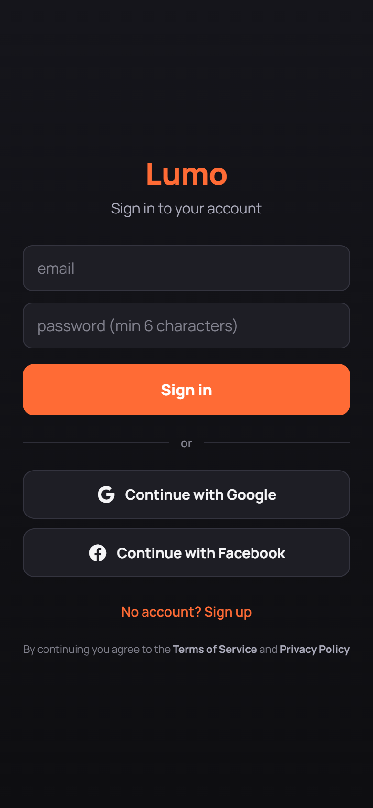
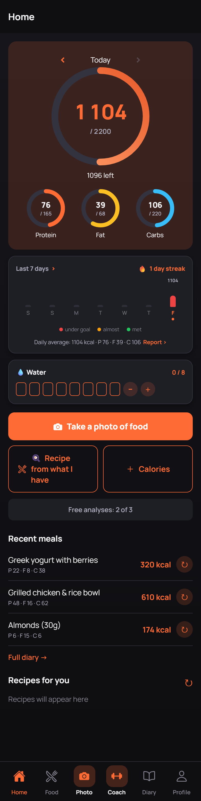
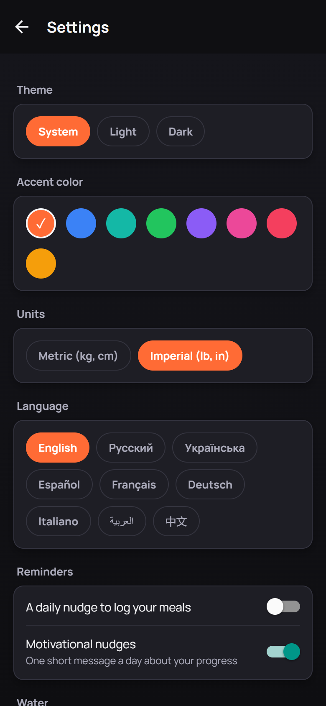

# Lumo

An AI-powered calorie and nutrition tracker built with React Native (Expo). Point your camera at a meal, and Gemini vision estimates calories, macros, and portion size — no manual food-database search required.

This is a solo full-stack side project built end-to-end: mobile app, Postgres schema with row-level security, and a serverless AI proxy. It's shared here as a portfolio piece rather than published to the app stores.

<p>
  
  
  
</p>

*Screenshots show the app's real screens with sample data (not a live account).*

## What it does

- **Photo → nutrition**: snap or upload a food photo, get calories/protein/fat/carbs and an editable per-ingredient breakdown (Gemini vision).
- **Barcode scanning**: packaged food lookup via Open Food Facts (free, no AI cost).
- **"Ask AI"**: estimate a dish from its name alone, or generate a recipe from ingredients you already have.
- **Diary**: daily log with editing, undo-delete, duplicate-entry protection, CSV export, and a "copy yesterday" shortcut.
- **Goals & onboarding**: computes a daily calorie/macro target from a short questionnaire, or accepts a manual target.
- **Progress tracking**: streaks, weight and water logging, a trends screen (30/90/180-day charts with a scrubber), achievements/badges, and a shareable weekly report image.
- **Personalization**: 9 languages (i18n), 3 themes, 8 accent colors, metric/imperial units, smart local reminders.
- **Auth**: Supabase email/password, with Google/Apple/Facebook wired up in code (pending provider configuration).

## Architecture

```
App.js                      # navigation shell + auth gate
src/
├── screens/                # one screen per feature (camera, result, diary, trends, ...)
├── services/
│   ├── aiService.js         # calls the Supabase Edge Function, maps API errors to user messages
│   ├── supabaseClient.js     # auth, Postgres (meals), Storage, RPC helpers
│   ├── openFoodFacts.js      # barcode → product lookup
│   └── authContext.js        # AuthProvider / useAuth()
├── theme/, settings/, i18n/  # theming, user preferences, 9-language i18n
└── ui/                       # shared design-system primitives (Button, Card, Chip, Screen, ...)

supabase/
└── functions/gemini/        # Edge Function: proxies Gemini, checks free-tier quota server-side,
                              # keeps the Gemini API key out of the client entirely

db/                          # numbered SQL migrations (run in order) — schema + RLS policies
```

**Why an Edge Function in front of Gemini:** the API key never ships in the client bundle. The function verifies the caller's Supabase JWT, enforces a free-analysis quota per user via a Postgres RPC, and only forwards allow-listed models.

## Tech stack

- **Expo SDK 54** (React Native 0.81, React 19) + React Navigation 7
- **Supabase** — Postgres, Auth, Storage, Edge Functions (Deno), Row-Level Security
- **Google Gemini** (vision + text) for food analysis, recipes, and feed generation
- **Open Food Facts** for barcode lookups
- `react-native-svg`, `react-native-view-shot`, `expo-notifications`, `i18n-js`

## Running it locally

```bash
npm install
cp .env.example .env   # fill in your own Supabase project URL + anon key
npx expo start
```

Scan the QR code with Expo Go (SDK 54). You'll also need to:
1. Run the SQL files in `db/` against your own Supabase project, in numeric order.
2. Deploy `supabase/functions/gemini` and set the `GEMINI_API_KEY` secret (`supabase secrets set GEMINI_API_KEY=...`) — get a free key at [aistudio.google.com/apikey](https://aistudio.google.com/apikey).

No API keys are required in the client — the anon key in `.env` is Supabase's public, RLS-protected key.

## License

MIT — see [LICENSE](LICENSE).
